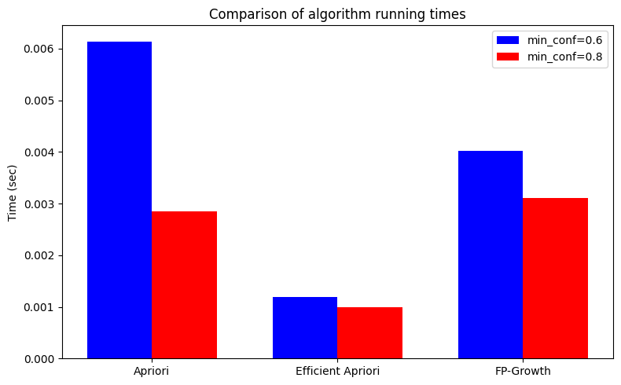

# Association Rules: Apriori, Efficient Apriori, FP-Growth

This project compares different algorithms for mining association rules on transactional data.

## 📊 Datasets
- `data.csv` – a custom dataset with transactions.
- Online Retail dataset (UCI Machine Learning Repository).

## ⚙️ Algorithms
- **Apriori (apriori_python)**
- **Efficient Apriori**
- **FP-Growth**

## 🖼️ Results
Comparison of execution times for algorithms with different minimum confidence values (`min_conf=0.6` and `0.8`).

Example of visualization:

Also, rule graphs are generated using **PyARMViz**.
